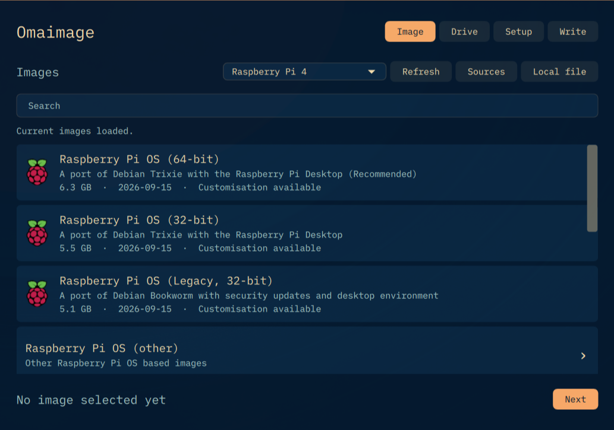

# Omaimage

A small Qt Quick app in the style of Omawrite and Omacalc. It writes ISO and image files to a USB drive and sets up Raspberry Pi images so the Pi boots straight away the first time it is plugged in.



The list comes from `https://downloads.raspberrypi.com/os_list_imagingutility_v4.json`, the same current images as Raspberry Pi Imager. Extra catalog URLs in that JSON format, and single download links, can be added in the app.

For Raspberry Pi OS you can set the user, password, Wi-Fi, country, keyboard, time zone, locale, SSH, hostname, interfaces, and Raspberry Pi Connect. Current images get cloud-init (`user-data`, `network-config`). Older images get a `firstrun.sh`.

The interface is English. If the system language is German, `translations/omaimage_de.ts` is used instead. Other languages fall back to English.

## Build

Dependencies on Omarchy: `qt6-base`, `qt6-declarative`, `qt6-quickcontrols2`, `qt6-svg`, `xz`, `gzip`, `zstd`, `libarchive` (`bsdtar`), `util-linux`, `polkit`.

```bash
qmake6 omaimage.pro
make -j"$(nproc)"
./omaimage --self-test
./bin/install.sh
```

`install.sh` installs the app to `~/.local/bin/omaimage` and adds a launcher.

Writing to the drive starts `pkexec` and asks for the administrator password. The system disk is never offered.

## Sources

Custom catalogs must contain an `os_list`, as expected by Raspberry Pi Imager. A single URL points at an `.img`, `.iso`, `.xz`, `.gz`, `.zip`, or `.zst` file. For local files and custom URLs you can choose the setup format. For current Raspberry Pi OS images that is “Raspberry Pi OS (cloud-init)”.

## Translations

Source strings are English (`qsTr` / `tr`). German lives in `translations/omaimage_de.ts`. After editing strings:

```bash
lupdate omaimage.pro
# edit translations/omaimage_de.ts
qmake6 omaimage.pro && make -j"$(nproc)"
```

The app loads the translation that matches the system locale.
